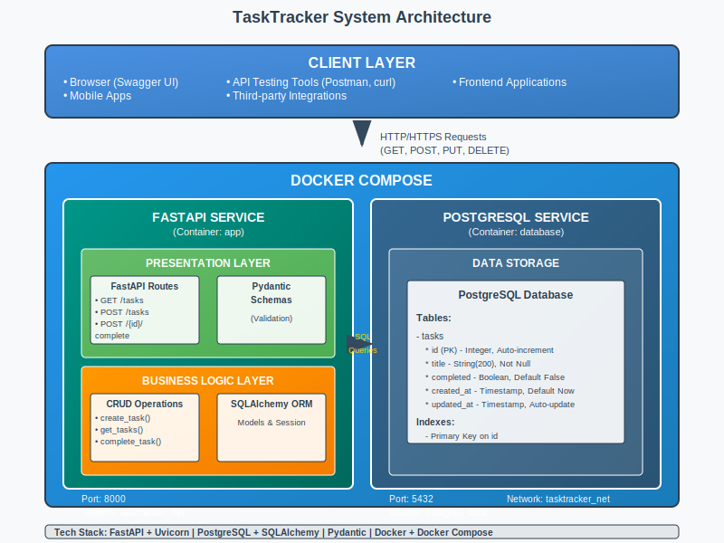

# 📋 TaskTracker

A modern task management API built with FastAPI, PostgreSQL, and Docker. This application demonstrates best practices in software engineering, including clean architecture, comprehensive testing, and containerized deployment.

## 🚀 Features

### 🎯 **Core Functionality**
- ✅ **Create new tasks** with title validation
- 📋 **List all tasks** with pagination and filtering
- ✅ **Mark tasks as completed**
- 🔄 **Update task details**
- 🗑️ **Delete tasks**
- 📊 **Get task statistics** (total, completed, pending)
- 🔍 **Filter tasks** by completion status

### 🌐 **Web Interface**
- 🖥️ **Modern React frontend** with responsive design
- 📱 **Mobile-friendly** interface
- ⚡ **Real-time updates** without page refresh
- � **Clean, intuitive UI** with smooth animations

### 🔧 **Developer Features**
- �🏥 **Health check endpoints**
- 📚 **Automatic API documentation** (Swagger UI & ReDoc)
- 🐳 **Docker containerization** for easy deployment
- 🧪 **Comprehensive testing** (unit & integration)
- 📝 **Type hints** and validation throughout

## 🏗️ Architecture

TaskTracker follows a **modern full-stack architecture**:

1. **Frontend**: React 18 with modern hooks and responsive design
2. **API Layer**: FastAPI REST endpoints with automatic documentation
3. **Business Logic**: CRUD operations with validation and error handling
4. **Data Layer**: PostgreSQL database with SQLAlchemy ORM
5. **Deployment**: Docker Compose with Nginx proxy



### 📁 Project Structure

```
tasktracker/
├── 📚 README.md              # Project documentation
├── 🤝 CONTRIBUTING.md        # Contributor guidelines  
├── 📄 LICENSE               # MIT license
├── 🐳 docker-compose.yml    # Multi-service orchestration
├── 📋 requirements.txt      # Python dependencies
├── 🚫 .gitignore           # Git ignore rules
├── 📁 app/                 # FastAPI backend
│   ├── 🚀 main.py          # FastAPI application
│   ├── 🗃️ models.py        # SQLAlchemy models
│   ├── 📝 schemas.py       # Pydantic schemas
│   ├── 🔧 crud.py          # Database operations
│   └── 🗄️ database.py     # Database configuration
├── 📁 frontend/            # React frontend
│   ├── 🎨 src/             # React source code
│   ├── 📦 package.json     # Node.js dependencies
│   └── 🐳 Dockerfile       # Frontend container
├── 📁 tests/               # Test suite
│   ├── 🧪 unit/            # Unit tests
│   └── 🔗 integration/     # Integration tests
└── 📁 docs/               # Documentation
    ├── 🏛️ ARCHITECTURE.md  # Architecture details
    ├── 📐 BEST_PRACTICES.md # Development guidelines
    └── 📊 SEQUENCE_DIAGRAMS.md # API flow diagrams
```

## 🛠️ Technology Stack

- **Backend**: FastAPI + Uvicorn
- **Frontend**: React 18 + Modern Hooks
- **Database**: PostgreSQL + SQLAlchemy
- **Validation**: Pydantic
- **Containerization**: Docker + Docker Compose
- **Proxy**: Nginx (for frontend)
- **Language**: Python 3.11, JavaScript (ES6+)

## 🚀 Quick Start

### Prerequisites

- Docker and Docker Compose installed
- Git (for cloning the repository)

### 1. Clone the Repository

```bash
git clone https://github.com/BaharakQaderi/tasktracker.git
cd tasktracker
```

### 2. Environment Setup

Copy the environment file and customize if needed:

```bash
cp .env.example .env
```

### 3. Start the Application

```bash
# Start all services (database + API)
docker-compose up -d

# View logs
docker-compose logs -f

# Check service status
docker-compose ps
```

### 4. Access the Application

- **Frontend Web UI**: http://localhost:3000
- **API Documentation (Swagger UI)**: http://localhost:8000/docs
- **Alternative Documentation (ReDoc)**: http://localhost:8000/redoc
- **Health Check**: http://localhost:8000/health
- **API Base URL**: http://localhost:8000

## 🖥️ Frontend Features

The React frontend provides a modern, responsive user interface with:

- 📱 **Responsive Design** - Works on desktop, tablet, and mobile
- ⚡ **Real-time Updates** - Instant task status changes
- 🎨 **Modern UI** - Clean, intuitive interface
- 📊 **Task Statistics** - Visual dashboard with task counts
- 🔍 **Filtering** - Filter tasks by completion status
- ✨ **Smooth Animations** - Enhanced user experience

## 📖 API Endpoints

### Health & Info

| Method | Endpoint | Description |
|--------|----------|-------------|
| GET | `/` | Root endpoint with API info |
| GET | `/health` | Health check with database status |

### Tasks

| Method | Endpoint | Description |
|--------|----------|-------------|
| GET | `/tasks` | List all tasks (with pagination/filtering) |
| GET | `/tasks/{id}` | Get specific task by ID |
| POST | `/tasks` | Create a new task |
| PUT | `/tasks/{id}` | Update an existing task |
| POST | `/tasks/{id}/complete` | Mark task as completed |
| DELETE | `/tasks/{id}` | Delete a task |

### Statistics

| Method | Endpoint | Description |
|--------|----------|-------------|
| GET | `/tasks/stats` | Get task statistics |

### Example API Usage

```bash
# Create a new task
curl -X POST "http://localhost:8000/tasks" \
     -H "Content-Type: application/json" \
     -d '{"title": "Learn FastAPI"}'

# Get all tasks
curl -X GET "http://localhost:8000/tasks"

# Mark task as completed
curl -X POST "http://localhost:8000/tasks/1/complete"

# Get task statistics
curl -X GET "http://localhost:8000/tasks/stats"
```

## 🔧 Development Setup

### Local Development (without Docker)

1. **Create virtual environment**:
```bash
python -m venv venv
source venv/bin/activate  # On Windows: venv\Scripts\activate
```

2. **Install dependencies**:
```bash
pip install -r requirements.txt
```

3. **Set up local PostgreSQL** and update `.env` file

4. **Run the application**:
```bash
uvicorn app.main:app --reload --host 0.0.0.0 --port 8000
```

### Database Management

```bash
# Access database container
docker-compose exec db psql -U postgres -d tasktracker

# View database logs
docker-compose logs db

# Reset database (⚠️ destroys all data)
docker-compose down -v
docker-compose up -d
```

### Application Logs

```bash
# View application logs
docker-compose logs backend

# Follow logs in real-time
docker-compose logs -f backend

# View specific service logs
docker-compose logs frontend
docker-compose logs db
```

## 🧪 Testing

### Run Tests

```bash
# Run all tests
pytest

# Run with coverage
pytest --cov=app

# Run specific test file
pytest tests/unit/test_crud.py

# Run integration tests
pytest tests/integration/test_api.py
```

### Manual Testing with Swagger UI

1. Open http://localhost:8000/docs
2. Click "Try it out" on any endpoint
3. Fill in the parameters
4. Click "Execute" to test

## 📊 Monitoring

### Health Checks

The application includes comprehensive health checks:

- **Application Health**: `GET /health`
- **Database Connectivity**: Verified in health endpoint
- **Docker Health Checks**: Configured in docker-compose.yml

### Logs

Structured logging is implemented throughout the application:

```bash
# Application logs
docker-compose logs app

# Database logs
docker-compose logs db

# All logs
docker-compose logs
```

## 🔒 Security Considerations

- **Input Validation**: All inputs validated with Pydantic schemas
- **SQL Injection Prevention**: SQLAlchemy ORM used throughout
- **Non-root Container**: Application runs as non-root user
- **Environment Variables**: Sensitive data stored in environment variables
- **Network Isolation**: Services communicate via Docker network

## 📈 Performance

- **Async Support**: FastAPI's async capabilities utilized
- **Database Connection Pooling**: Configured in SQLAlchemy
- **Pagination**: Large result sets are paginated
- **Indexing**: Database indexes on frequently queried fields

## 🚀 Deployment

### Production Deployment

1. **Update environment variables** for production
2. **Use production database** credentials
3. **Configure reverse proxy** (nginx/Apache)
4. **Set up SSL/TLS** certificates
5. **Configure monitoring** and logging

### Environment Variables

| Variable | Description | Default |
|----------|-------------|---------|
| `DATABASE_URL` | PostgreSQL connection string | `postgresql://postgres:password@db:5432/tasktracker` |
| `API_HOST` | API host binding | `0.0.0.0` |
| `API_PORT` | API port | `8000` |
| `LOG_LEVEL` | Logging level | `INFO` |
| `SECRET_KEY` | Application secret key | `your-secret-key-change-in-production` |

## 🤝 Contributing

1. Fork the repository
2. Create a feature branch (`git checkout -b feature/amazing-feature`)
3. Commit your changes (`git commit -m 'Add amazing feature'`)
4. Push to the branch (`git push origin feature/amazing-feature`)
5. Open a Pull Request

## 📝 License

This project is licensed under the MIT License - see the [LICENSE](LICENSE) file for details.

## 📞 Support

If you have any questions or need help:

1. Check the [API documentation](http://localhost:8000/docs)
2. Review the [architecture guide](docs/ARCHITECTURE.md)
3. Read the [best practices](docs/BEST_PRACTICES.md)
4. Open an issue in the repository

## 🔄 Changelog

### v1.0.0 (2025-07-09)
- Initial release
- Core CRUD operations for tasks
- React frontend with modern UI
- Docker containerization with multi-service setup
- Comprehensive API documentation
- Health checks and monitoring
- Complete test suite
